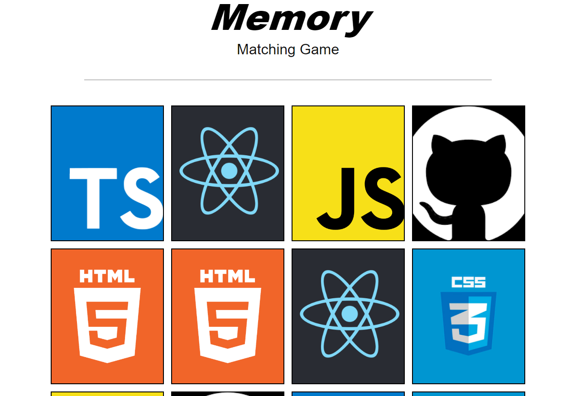

# Memory Matching Game

## 📝 Sobre o Projeto

O site consiste em um jogo da memória implementado em React JS.

## ⚛️ Tecnologias Utilizadas
React JS  
CSS

## 💽 Como Iniciar o Projeto
para baixar as dependências utilize `npm install`  
utilize o comando `npm start` para inicializar.

## 💻 Preview do Projeto

